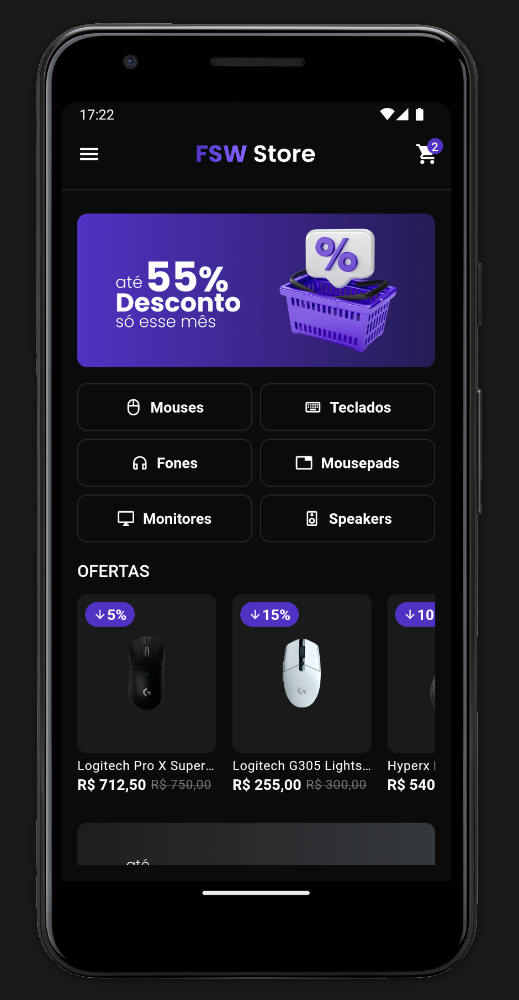

# FSW Store

Loja online

## Tecnologias

- Framework: [**Flutter**](https://flutter.dev/)
- Autenticação: [**Firebase**](https://firebase.google.com/?hl=pt-br)
- Banco de Dados: [**Supabase**](https://supabase.com/)
- Integração com pagamento: [**Stripe**](https://stripe.com/br)

## Pacotes

 - [flutter_svg](https://pub.dev/packages/flutter_svg): Usado para renderização de SVG.
 - [supabase_flutter](https://pub.dev/packages/supabase_flutter): Cliente para comunicação com o Supabase.
 - [flutter_dotenv](https://pub.dev/packages/flutter_dotenv): Usado para gerenciamento de variáveis de ambiente.
 - [json_annotation](https://pub.dev/packages/json_annotation): Usado para definir anotações para [json_serializable](https://pub.dev/packages/json_serializable), que é usado para criar código para serialização e desserialização JSON.
 - [get](https://pub.dev/packages/get): Usado para gerenciamento de estado, navegação, injeção de dependências e utilitários.
 - [bloc](https://pub.dev/packages/bloc): Usado para ajudar na implementação do padrão [BLoC pattern](https://www.flutteris.com/blog/en/reactive-programming---streams---bloc).
 - [flutter_bloc](https://pub.dev/packages/flutter_bloc): Usado em conjunto com bloc para gerenciamento de estado.
 - [logger](https://pub.dev/packages/logger): Usado para imprimir logs.
 - [flutter_stripe](https://pub.dev/packages/flutter_stripe): Usado para integração com pagamento.
 - [http](https://pub.dev/packages/http): Usado para consumir dados da internet.
 - [intl](https://pub.dev/packages/intl): Usada para definir localidade padrão e métodos para acessar a maioria dos mecanismos de internacionalização, e classes de formatação de datas, moeda, etc.
 - [firebase_core](https://pub.dev/packages/firebase_core)
 - [firebase_auth](https://pub.dev/packages/firebase_auth): Usado em conjunto com o [google_sign_in](https://pub.dev/packages/google_sign_in) para autenticação.
 - [shimmer](https://pub.dev/packages/shimmer): Usado para criar loading (skeleton).
 - [cached_network_image](https://pub.dev/packages/cached_network_image): Usado para lidar com o cache de imagens.
 - [get_storage](https://pub.dev/packages/get_storage): Usado para salvar dados localmente.
 - [readmore](https://pub.dev/packages/readmore): Usado para gerenciar a visibilidade de textos grandes, por exemplo, (...ver mais, ...ver menos).
 - [expandable](https://pub.dev/packages/expandable): Usado para widgets que se expandem.
 - [build_runner](https://pub.dev/packages/build_runner)
 - [json_serializable](https://pub.dev/packages/json_serializable)
 - [flutter_animate](https://pub.dev/packages/flutter_animate): Usado para criar animações
    
  
## Capturas de Tela

### Tela Inicial

### Tela do Produto

### Tela do Carrinho de Compras

### Tela de Pedidos

